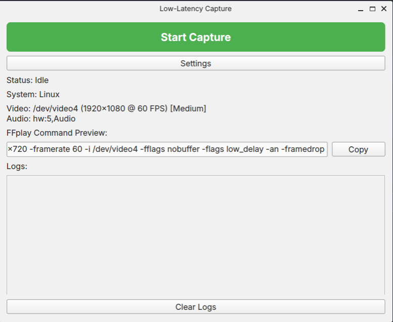

# VideoCapturePy

A low-latency video capture GUI application built with PyQt6 and ffmpeg. Supports Linux, macOS, and Windows.


## Use cases
Useful for capturing live video over connected devices, such as HDMI capture devices, from devices such as game consoles for low latency experiences. 

## Dependencies

### System Packages

- **ffmpeg** — Required for video/audio capture and playback (`ffmpeg` and `ffplay` must be available on your `PATH`).

  - **Linux (Debian/Ubuntu):**
    ```bash
    sudo apt install ffmpeg
    ```
  - **Linux (Fedora):**
    ```bash
    sudo dnf install ffmpeg
    ```
  - **macOS (Homebrew):**
    ```bash
    brew install ffmpeg
    ```
  - **Windows:** Download from [ffmpeg.org](https://ffmpeg.org/download.html) and add to your `PATH`.

### Python

- Python **3.14+**
- [PyQt6](https://pypi.org/project/PyQt6/)

Python dependencies are listed in `pyproject.toml` and can be installed with:

```bash
pip install .
```

Or using [uv](https://github.com/astral-sh/uv):

```bash
uv sync
```

## Usage

```bash
python main.py
```

The application opens a GUI window for low-latency video capture. Use the settings dialog to configure your video/audio devices, resolution, frame rate, and quality.

## Configuration

Settings are stored in `config.ini` and are auto-created with sensible defaults for your platform:

| Setting        | Description                          |
|----------------|--------------------------------------|
| `video_fmt`    | Video input format (e.g. `v4l2`)     |
| `audio_fmt`    | Audio input format (e.g. `alsa`)     |
| `video_dev`    | Video device path                    |
| `audio_dev`    | Audio device identifier              |
| `res`          | Capture resolution (e.g. `1280x720`) |
| `fps`          | Frames per second                    |
| `quality`      | Quality preset (Low/Medium/High)     |
| `input_format` | Input pixel format (e.g. `mjpeg`)    |

## Project Structure

```
main.py             — Entry point and platform utilities
capture_gui.py      — Main GUI window (CaptureGUI)
settings_dialog.py  — Settings dialog (SettingsDialog)
audio_manager.py    — Audio device management (AudioManager)
config.py           — Default configuration and constants
build.py            — Build/packaging script
pyproject.toml      — Project metadata and dependencies
```

## Building

A PyInstaller spec file (`VideoCapturePy.spec`) and build script (`build.py`) are included for creating standalone executables.

## License

See the project repository for license details.
